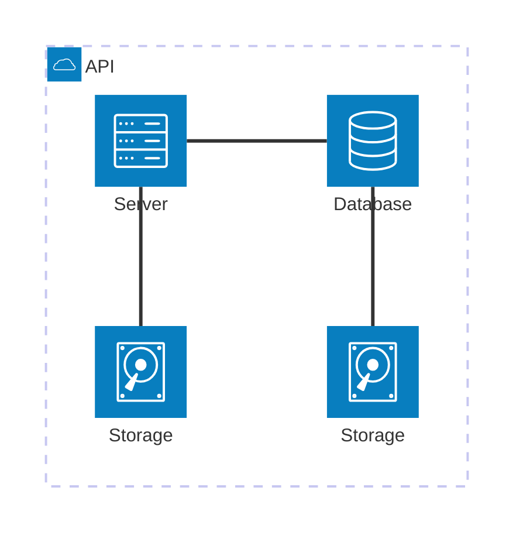
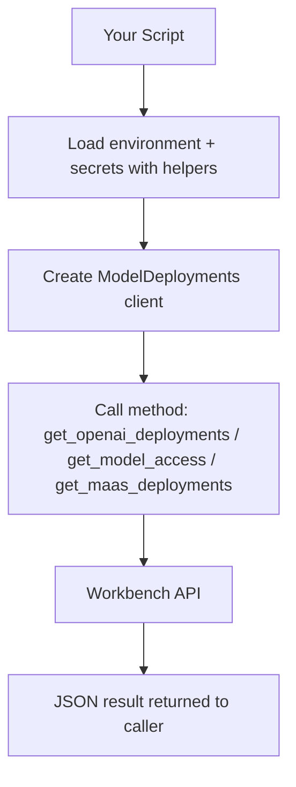

# Mermaid Tests

```mermaid
architecture-beta
    group api(cloud)[API]

    service db(database)[Database] in api
    service disk1(disk)[Storage] in api
    service disk2(disk)[Storage] in api
    service server(server)[Server] in api

    db:L -- R:server
    disk1:T -- B:server
    disk2:T -- B:db
```
# A flow chart

```mermaid
%% filepath: /workspaces/emergingtech-workbench-cookbook/scripts/use-cases/model-deployments/model-deployments.md
flowchart TD
    A[Your Script] --> B[Load environment + secrets with helpers]
    B --> C[Create ModelDeployments client]
    C --> D[Call method: get_openai_deployments / get_model_access / get_maas_deployments]
    D --> E[Workbench API]
    E --> F[JSON result returned to caller]
```
